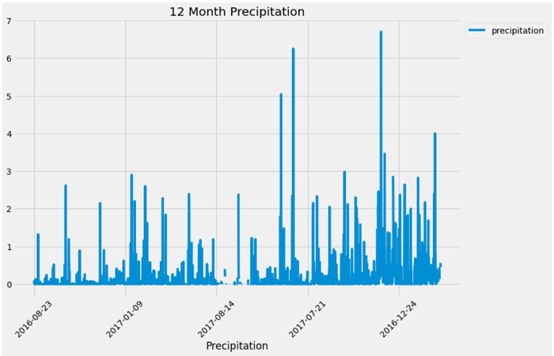
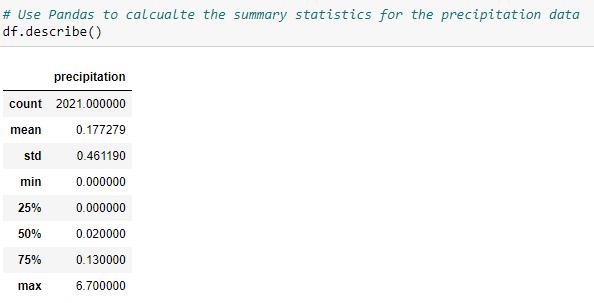
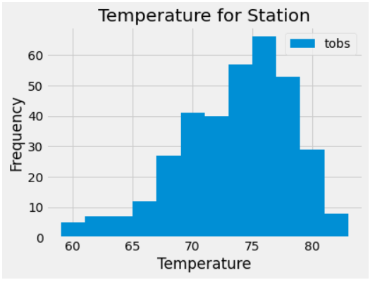
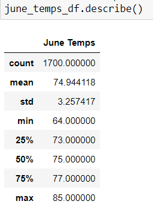
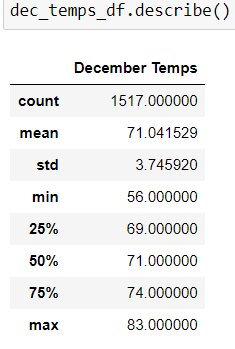

# surfs_up
SQLite, SQLAlchemy, and Flask 

# Surf and Ice Cream on Oahu
## Overview of Project
### Purpose
I have a passion for surfing and the addiction to ice cream, so I want to open a shop that provides both in Oahu. To get the approval of a serious investor, W. Avy, I needed to ease his worries regarding the weather on the island. The more sun and less rain equals better business for the shop! Using my new skills and knowledge of SQL light, Flask, and Pandas I was able to pull data that would solidify W. Avy's decision to invest in my business endeavor. 
 
## Results and Analysis
### First Results
My first attempt at providing W. Avy with weather statistics for Oahu was by presenting him with the precipitation over the last 12 months to give him historical data of how little it rains during the year which would prevent the shop from being closed. As the graph and the data table of statistics show, there is few times that there is a lot of rain on Oahu. 

Then to accompany that data, I was able to check the quality of the data by establishing which of the 9 stations was most active and provide minimum, maximum, and average temperatures for that station. To make the information easier to understand at a quick glance, I created a histogram of the temperatures. The data and graph both show that the temperatures of the most active station stay way above the 65-degree mark for the majority of the year, which is good for selling ice cream and surf boards. 

### June and December Results 
While that information was important, W. Avy wanted to know specific temperature data for the months of June and December in Oahu to help him feel more at ease.
This was very helpful to see that the temperatures for both months are quite high. The mean or average for both months are in the 70s. That is reassuring to know that even in the winter months we can still expect customers based on the temperature. 

#### June Results

#### December Results

## Summary
With all the data collected, W. Avy seems to be very certain that investing in my Ice Cream and Surfboard shop will be a successful business move. The temperatures seem to stay warm enough that it won't hurt business for months of the year. It also helps to know that it won't be so rainy during the year either.

While the temperature data provided is quite helpful, if that data isn't enough to convince my investor, I could easily provide the precipitation statistics for June and December as well to give a fuller picture. 

If that still isn't enough; I would be willing to pulling data for other months such as March and October could be helpful to get a glimpse of the quarters of the year and ensure that other parts of the year won't be detrimental to our success. 
